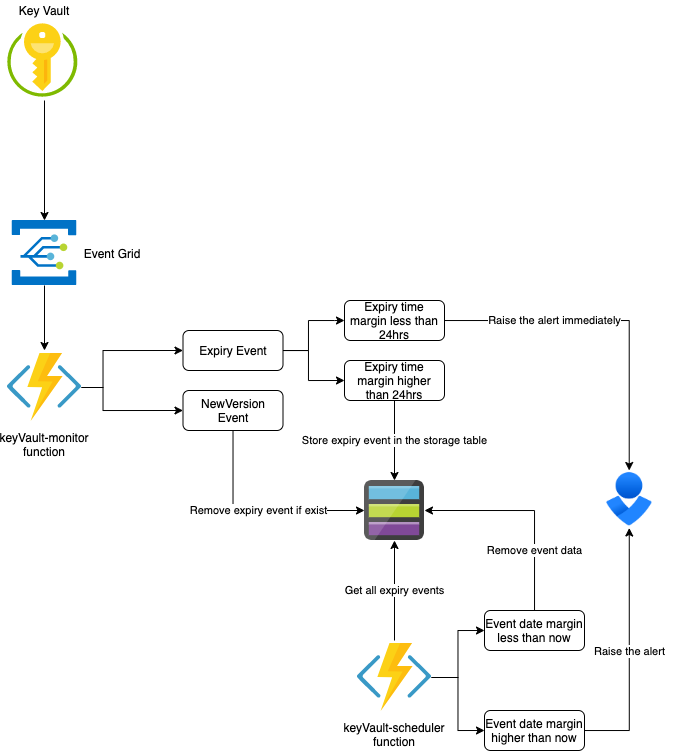

  
# [Azure] Key Vault Monitoring Framework  
  

# Informational
- Visit **Schuberg Philis** official web page https://schubergphilis.com/
- To get the **full picture** about this project, please read the Medium story.

# Disclaimer
- Schuberg Philis has designed the monitoring framework as an in-house project, which might be used and implemented across its customer environments.
- For the demo purposes, we have stripped out(removed) all non-generic(sensitive) information from the solution, such as code blocks, subscription and resource IDs, etc.

# Solution Overview
- **Microsoft [Azure] Key Vault monitoring framework** based on Azure Function, Powershell, Event Grid, and OpsGenie.
- With the available option of utilizing the Key Vault events through the desired automation engine, we have designed and implemented the Key Vault monitoring framework.
- The framework is capable of:
1. Monitoring and raising the alerts about all entities that can be stored in the Key Vault, at the moment those are Keys, Secrets, and Certificates.
2. Dealing with alert re-occurrence/reminders, raising the alert more than once - on daily basis, so you do not forget about your expiries.
3. Solution uses a specific helper to raise the alerts via OpsGenie, this can be refined to fit your own pager-duty system.

# Technical design
- Two applications, both of them deployed to one Azure Function, deeper dive about each application is covered at the Medium post.  
- Azure Function applications are codified into PowerShell.
- Function applications are leveraging the external PowerShell module, which is serving to store and remove the event data from the storage table, raise the OpsGenie alert, perform tests, etc.
- The storage table is used to track the state of the expiry of the events.
- If the entity is about the expire and it triggers an event thirty days in advance, we do not want to raise the alert and forget about it, rather - we want to store the event data in the table and receive re-occurring alerts on a daily basis.
- Event grid implementation against the Key Vault service. Certain events produced by the Key Vault are forwarded to the Azure Function, which is handling the event data with our pre-defined logic.
- We are utilizing OpsGenie as a pager, to classify alerts and adjust the alert visualization, and deliver to the appropriate team.

# Pipeline overview
- We wrote/created the whole structure of the deployment/pipeline utilizing the Azure DevOps logic, to reflect Microsoft principles.  
- Multiple components are comprising the pipeline, we have utilized native Azure Pipelines YAML syntax, Powershell helpers, ARM templates, and other techniques to achieve the goal.  
- The pipeline is defined into two stages, stages further contain direct or external steps - which might live in their own file.  

## Build stage
    - Scans source(Powershell) code via the PSScrypt Analyzer tool.  
    - Archives source code, both Azure Function code and Powershell helper module.  
    - Publishes the package/artifact, so that the next stage can consume it.  

## Deploy stage
    - Does some variable magic to construct the names of the services which will be deployed, to get more context - please have a peek into the variables folder.  
    - Deploys the Key Vault, where the OpsGenie webhook will be stored, and the same Key Vault will subscribe/forward its events to the automation endpoint - Azure Function.  
    - Deploys Key Vault secret - OpsGenie webhook is deployed as a secret, and the secret is later on referenced through the app configuration, preventing the plain-text exposure.  
    - Deploys the Azure Function app.
        - Storage account where function app runtime files will be stored, as well as the storage table which will be used for the event/state tracking.  
        - App service plan - compute-unit which will host our Azure Function application.  
        - Autoscale settings, some basic scaling settings for our app service plan.  
        - Azure Function - application container which will hold and run our code.  
        - Artifact that was generated during the Build stage, is being picked up and deployed as a function app code.  
    - Deploys Key Vault access policy, object ID/function app principal is authorized to retrieve secrets from the Key Vault, to consume the OpsGenie webhook.  
    - Deploys app service settings, some Powershell configuration parameters, such as runtime version, and the reference to the Key Vault secret.  
    - Deploys Event Grid subscription, creates a sudo connection between Key Vault service and Azure Function application - to where the Key Vault subscribed events are being delivered for consumption.  

# Deployment
- We assume that you have in place your Azure subscription and Azure DevOps organization.
- To deploy the Key Vault monitoring framework into your environment, you can follow these steps.
1. Initialize a new repository in your Azure DevOps organization.
2. Create a service connection between your Azure ecosystem(subscription/resource group) and your Azure DevOps organization, make sure your service principal has proper rights to deploy resources.
3. Clone this repository.
4. Configure new upstream(origin) of the cloned repository to point to the repository that you have previously initialized, or you can copy files between repositories - if you find that easier.
5. Commit and push the changes.
6. In the Azure DevOps portal, navigate to Pipelines, create a new pipeline, select Azure Repos Git, select your repository, select existing YAML pipeline(file), choose /_ci/azure-pipelines.yaml and save the pipeline.
7. Click on a run pipeline, you will be prompted to fill in some parameters, we have set some defaults that should be adjusted to fit your environment.
    - connectedServiceName: Fill the name of the service connection that you created in step 2.
    - resourceGroupName: Name of the resource group where the resources will be provisioned.
    - environment: Environment name, you can leave this as a prd001(default), this parameter is used to construct the resource names.
    - resourceName: Base name for the services which will be provisioned, adjust this to something else because the storage account with the same name might already exist (example).
    - opsGenieWebhook: Webhook of your OpsGenie integration, this should be the same URI as for your Azure Monitor Metric alerts.  
        - Example: https://api.opsgenie.com/v1/json/azure?apiKey=GUID
8. Run the pipeline, take an apple, and enjoy the magic, especially if you like the green color.

# Action
- To receive the expiry alert related to some entity, you can either
    1. Create a Key Vault Key and set the expiry date, between now and 30 days in advance.
    2. Create a Key Vault Secret and set the expiry date, between now and 30 days in advance.
    3. Create/Upload a Key Vault Certificate and set the expiry day, between now and 30 days in advance.
- After the expiry event is detected and routed through the Event Grid subscription, the Azure Function will kick-off and send the formatted alert to the OpsGenie.  
- Please have a look at the OpsGenie section.
- The successfully raised alert will look like:  

# OpsGenie overview
- The whole solution is heavily pointing to the OpsGenie integration, considering that OpsGenie parameters are different per implementation, we could not make this too generic, or we could - but it would be too simple.
- The PowerShell helper which is raising the OpsGenie alert should be adjusted to fit your OpsGenie or other pager integration.
- By reverse-engineering the Powershell helpers and looking into your OpsGenie integration, you can build the solution that best suits your needs.  
- With this in mind, we can give you some guidelines on how you can configure your OpsGenie integration, but not the full-picture since some parts are confidential.  
- We have configured our integration to parse the Azure Monitor Metric alerts and extract specific information, like below, Powershell helpers are written to reflect/fit the same spectrum of information.  

# Feedback
- We are happy to receive your feedback about improvements, feel free to send us a pull request.

## Schuberg Philis